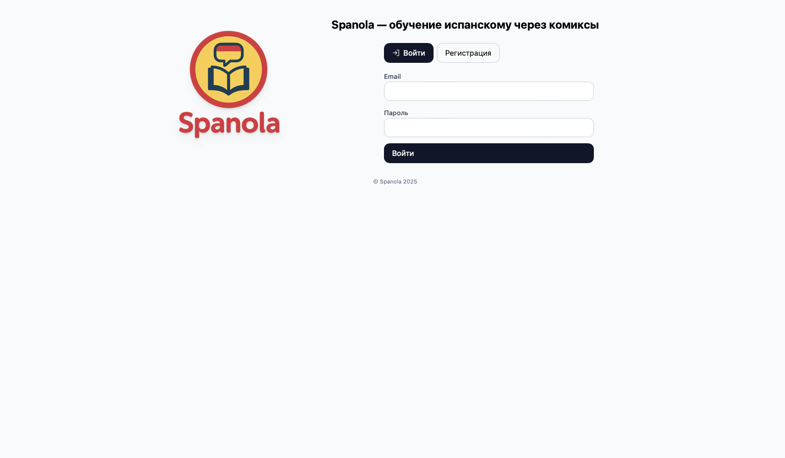
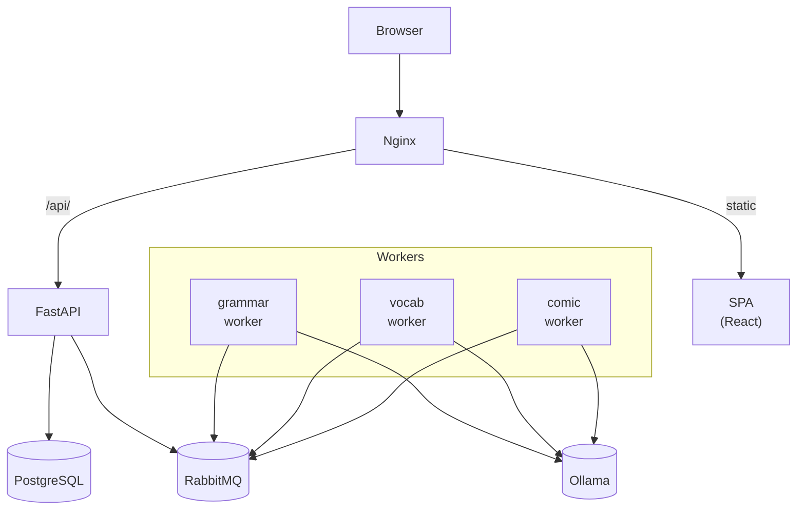

# 🇪🇸 Spanola ML App — сервис для изучения испанского языка

<p align="center">
  
</p>

Этот проект представляет собой прототип обучающего сервиса, который помогает изучать испанский язык в формате интерактивных комиксов. Задания адаптируются под уровень пользователя и позволяют зарабатывать баллы за прогресс.

## 🚀 Основные возможности

- Регистрация/вход пользователя, JWT-аутентификация  
- Тематические задания (комиксы, словарь, грамматика) для уровней A1/A2  
- Балансы/история операций кошелька, списания/пополнения  
- Асинхронная генерация заданий через RabbitMQ и ML-воркеры  
- Подключение локальной LLM через **Ollama** (по умолчанию `qwen2.5:3b-instruct`)

## 🖼️ Как это выглядит



## 🧩 Стек

- **Frontend:** React (Vite) — SPA, раздаётся Nginx  
- **Backend:** FastAPI + SQLModel + PostgreSQL  
- **Очереди:** RabbitMQ, воркеры `grammar`, `vocab`, `comic`  
- **LLM:** Ollama (`qwen2.5:3b-instruct`)  
- **Тесты:** pytest

## 🏗️ Архитектура



  
## 🚀 Быстрый старт

```bash
# 1) env’ы (шаблоны без секретов)
cp app/.env.example app/.env
cp frontend/.env.example frontend/.env     # по умолчанию VITE_API_BASE=/api

# 2) сборка/образы
docker compose build app
docker compose pull rabbitmq database ollama web-proxy

# 3) инфраструктура
docker compose up -d database rabbitmq ollama
# (по желанию — заранее подтянуть модель)
docker compose up -d ollama-pull

# 4) приложение и воркеры
docker compose up -d app worker-grammar worker-vocab worker-comic web-proxy

# фронт:
open http://localhost

# Swagger:
open http://localhost/api/docs
